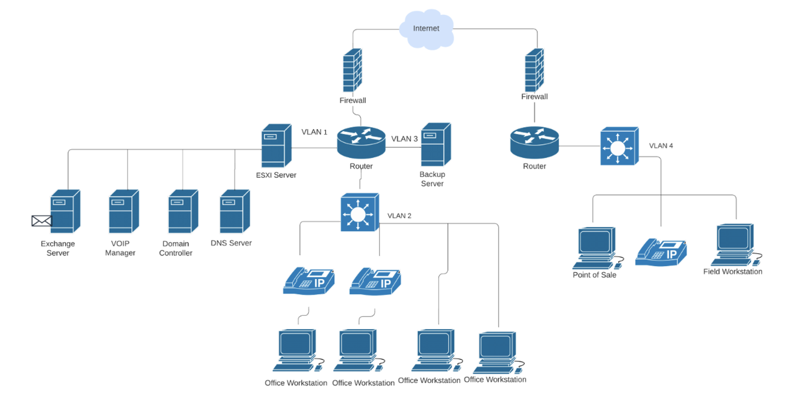

# Enterprise Cybersecurity Modernization

## Table of Contents

- [Executive Summary](#executive-summary)
- [Business Challenge](#business-challenge)
- [Engagement Lifecycle](#engagement-lifecycle)
- [Security Modernization Strategy](#security-modernization-strategy)
- [Python Security Toolkit](#python-security-toolkit)
- [Enterprise Architecture](#enterprise-architecture)
- [Assessment Evidence](#assessment-evidence)
- [Executive Reports](#executive-reports)
- [Quick Start](#quick-start)
- [Skills Demonstrated](#skills-demonstrated)
- [Framework Alignment](#framework-alignment)
- [Disclaimer](#disclaimer)

## Executive Summary

This repository showcases a complete cybersecurity consulting engagement for FICBANK, a fictional mid-sized financial institution. It demonstrates how [network assessments](engagement-artifacts/01-network-assessment/nmap-nse-results.png), [vulnerability findings](engagement-artifacts/02-vulnerability-assessment/nessus-vulnerability-summary.png), [security logs](engagement-artifacts/03-security-monitoring/), and [incident evidence](engagement-artifacts/04-incident-response/) can be transformed into a [practical security modernization plan](architecture/).

The project highlights skills in risk analysis, Zero Trust architecture, network segmentation, SIEM and detection engineering, vulnerability management, incident response, and [executive-level reporting](reports/). It also includes six developed [Python utilities](scripts/) that demonstrate security automation and data-analysis capabilities.

The repository is designed as a portfolio case study. All [public sample data](sample-data/) is synthetic, and no real financial institution, customer information, or production environment is represented.



Above is **Figure 1.**, the diagram of the FICBANK network architecture used throughout the engagement. 

## Business Challenge

FICBANK faces several cybersecurity challenges, including exposed administrative services, limited network segmentation, gaps in security monitoring, inconsistent alerting, and an immature vulnerability management program. Collectively, these weaknesses increase the organization's exposure to unauthorized access, lateral movement, delayed threat detection, and operational risk.

The objective of this engagement is to reduce the organization's attack surface, strengthen identity and access controls, improve threat detection and incident response, and implement a repeatable, risk-based security program that prioritizes vulnerabilities, validates security improvements, and supports continuous risk reduction.

## Cybersecurity Engagement Lifecycle
This project performed an end-to-end cybersecurity consulting engagement, showing how technical findings are transformed into actionable security improvements. The workflow progresses from identifying security weaknesses to investigating threats, prioritizing risk, and developing a long-term security modernization strategy.

1. **Network assessment:** Discover internet-facing assets, identify exposed services, and evaluate the organization's attack surface.
2. **Vulnerability assessment:** Analyze security findings, assess risk, and prioritize remediation based on business impact.
3. **Security monitoring:** Improve security visibility by identifying monitoring gaps and developing Splunk detection and alerting capabilities.
4. **Incident response:** Investigate suspicious activity, extract indicators of compromise (IOCs), and organize evidence to support incident analysis.
5. **Risk analysis:** Evaluate vulnerabilities using exploitability, exposure, severity, and business criticality to guide remediation priorities.
6. **Security modernization:** Translate assessment findings into a defense-in-depth strategy incorporating Zero Trust, network segmentation, SIEM, endpoint protection, and vulnerability management.

## Security Modernization Strategy
This stage of the project transformed assessment findings into a practical, enterprise-wide security strategy. Rather than recommending isolated technologies, the proposed architecture integrates complementary security controls that reduce risk, improve visibility, and strengthen the organization's overall security posture. The security modern strategy action steps are below:

- **Strengthen network security** by segmenting Internet-facing, internal, data, endpoint, and management systems into dedicated security zones.
- **Implement Zero Trust access controls** by continuously verifying user identity, device health, and least-privilege permissions before granting access.
- **Improve security visibility** by centralizing logs, alerts, identity events, endpoint telemetry, and vulnerability data within Splunk Enterprise Security.
- **Enhance threat detection** and response with Endpoint Detection and Response (EDR) capabilities that support rapid investigation, containment, and forensic evidence collection.
- **Establish a risk-based vulnerability management** program that prioritizes remediation, validates security updates, and tracks approved risk exceptions.
- **Drive continuous improvement** by feeding assessment results, incident investigations, and control validation back into detection rules, risk assessments, and future security decisions.

## Python Security Toolkit

As part of the project, a collection of Python utilities is developed to automate common cybersecurity tasks, demonstrating practical experience in security engineering, data analysis, and workflow automation. Together, these tools help streamline security assessments, prioritize risk, support incident investigations, and accelerate detection engineering. Implementation details, assumptions, usage examples, and limitations are available in [scripts/README.md](scripts/README.md).

| Utility | Demonstrated skill | Primary output |
| --- | --- | --- |
| `log_parser.py` | Security log analysis | Severity, authentication, source, and suspicious-event summary |
| `nmap_parser.py` | Network exposure assessment | Hosts, services, sensitive ports, and observed risk level |
| `vulnerability_summary.py` | Vulnerability management | Severity trends, affected assets, exposed services, and remediation tiers |
| `risk_calculator.py` | Asset-level risk ranking | Calculate asset risk scores using business criticality, exposure, exploitability, and CVSS metrics |
| `ioc_extractor.py` | Incident triage and threat hunting | Extracts and normalizes IPs, domains, URLs, CVEs, file hashes, and other indicators of compromise (IOCs) |
| `splunk_query_generator.py` | Detection engineering | Generates Splunk SPL searches with MITRE ATT&CK mapping and tuning guidance  |

## Enterprise Architecture

A collection of architecture diagrams that illustrate the organization's proposed security design, including Zero Trust, network segmentation, identity and access management, security monitoring, endpoint protection, and vulnerability management. 

| Architecture view | Security focus |
| --- | --- |
| [Defense-in-depth security architecture](architecture/01-enterprise-security-architecture.md) | Designs a layered enterprise security architecture that reduces organizational risk |
| [Identity and access workflow](architecture/02-zero-trust-access-flow.md) | Implements identity-based access control using Zero Trust and least-privilege principles |
| [Network segmentation model](architecture/03-network-segmentation.md) | Limits lateral movement through security zones and controlled network access |
| [Splunk security architecture](architecture/04-splunk-monitoring-architecture.md) | Centralizes security monitoring, threat detection, and incident investigation |
| [Endpoint detection workflow](architecture/05-edr-workflow.md) | Improves endpoint visibility, threat containment, and forensic investigations |
| [Vulnerability management lifecycle](architecture/06-vulnerability-management-lifecycle.md) | Prioritizes vulnerabilities, validates remediation, and supports continuous risk reduction |

The diagrams supporting design rationale and Mermaid source remain available in the [architecture directory](architecture/).

## Assessment Evidence

A centralized collection of scan results, screenshots, logs, and technical artifacts that validate assessment findings, support remediation recommendations, and provide an auditable record of the security assessment. The general utilities are under. The generalized utilities are under [scripts](scripts/README.md) and synthetic examples are under [sample-data](sample-data/).

- [Network assessment evidence](engagement-artifacts/01-network-assessment/)
- [Vulnerability assessment evidence](engagement-artifacts/02-vulnerability-assessment/)
- [Security monitoring evidence and provenance](engagement-artifacts/03-security-monitoring/)
- [Incident response evidence](engagement-artifacts/04-incident-response/)

## Executive Reports
Professional reports designed to communicate [security findings](engagement-artifacts/), risk assessments, and remediation strategies in a clear and actionable format for technical and executive stakeholders

- [Security Assessment Report](reports/FICBANK-Security-Assessment-Report.pdf)
- [Technical Controls Report](reports/FICBANK-Technical-Controls-Report.pdf)

The reports translate technical evidence into business impact, prioritized recommendations, control direction, and decision-ready guidance for executive and technical stakeholders. These PDF reports describe the original controlled assessment scenario. Public sample data under [sample-data](sample-data/) is synthetic, and the six Python utilities under [scripts](scripts/) are supplemental portfolio engineering artifacts. The utilities should not be represented as tools deployed in the fictional FICBANK environment.

## Quick Start

Python 3.12 or later is recommended. The utilities require no third-party runtime packages.

These commands exercise the supplemental python utilities with public synthetic inputs.

```text
python scripts/log_parser.py sample-data/sample.log
python scripts/nmap_parser.py sample-data/sample_nmap.xml
python scripts/vulnerability_summary.py sample-data/sample_nessus.csv
python scripts/risk_calculator.py sample-data/sample_assets.csv sample-data/sample_findings.csv
python scripts/ioc_extractor.py sample-data/sample_incident_report.txt
python scripts/splunk_query_generator.py failed_login
```

Each file-based utility can also run with its default sample input. Display a CLI contract with `python scripts/<utility>.py --help`.

## Skills Demonstrated

Demonstrated proficiency in conducting enterprise security assessments, analyzing attack surfaces, prioritizing and remediating vulnerabilities, designing Zero Trust security architectures, implementing network segmentation strategies, developing and tuning Splunk detections, performing incident and IOC analysis, automating security workflows with Python, and communicating technical findings through executive-level reports.

## Framework Alignment

| Framework or principle | Application |
| --- | --- |
| NIST SP 800-53 Rev. 5 | Access control, audit, incident response, risk assessment, configuration, and system integrity alignment |
| NIST SP 800-115 | Technical assessment planning, discovery, analysis, reporting, and remediation validation |
| NIST Zero Trust | Resource-centric access, continuous context, least privilege, explicit decisions, and enforcement |
| CISA Zero Trust Maturity Model | Identity, devices, networks, applications, data, visibility, analytics, automation, and orchestration |
| MITRE ATT&CK | Adversary-technique context for detections, investigations, and coverage analysis |
| Defense in Depth | Layered preventive, detective, responsive, and governance controls |

## Disclaimer

FICBANK is entirely fictional. The screenshots and PDF reports preserve a controlled assessment scenario, while the public runnable examples use synthetic data. The supplemental utilities were not deployed in FICBANK or any real financial institution. Nothing in this repository represents access to, assessment of, or deployment within a real financial institution. Environment-specific validation is required before applying any material as production security guidance.
