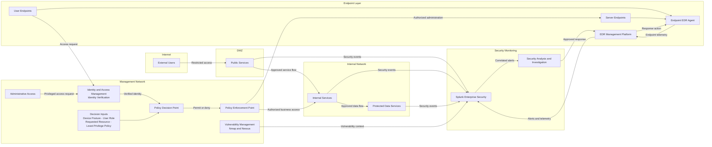

# Enterprise Security Architecture

This diagram presents the proposed defense-in-depth target state for FICBANK, a fictional financial institution. It separates externally reachable services, internal resources, privileged administration, endpoint protection, and centralized security monitoring while applying distinct identity verification, policy decision, and policy enforcement functions.

The proposed separation limits direct exposure of SMB, RDP, SSH, and administrative interfaces. Explicit policy decisions and enforcement reduce unauthorized access and lateral movement, while endpoint telemetry, vulnerability context, and security events converge in Splunk Enterprise Security to address limited monitoring, alerting gaps, and incomplete visibility.
