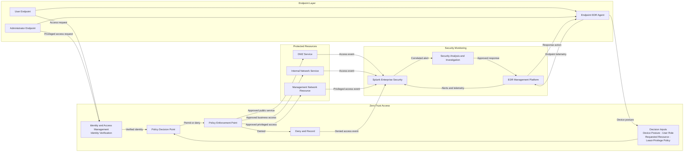
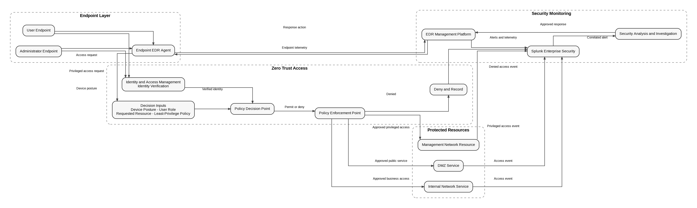
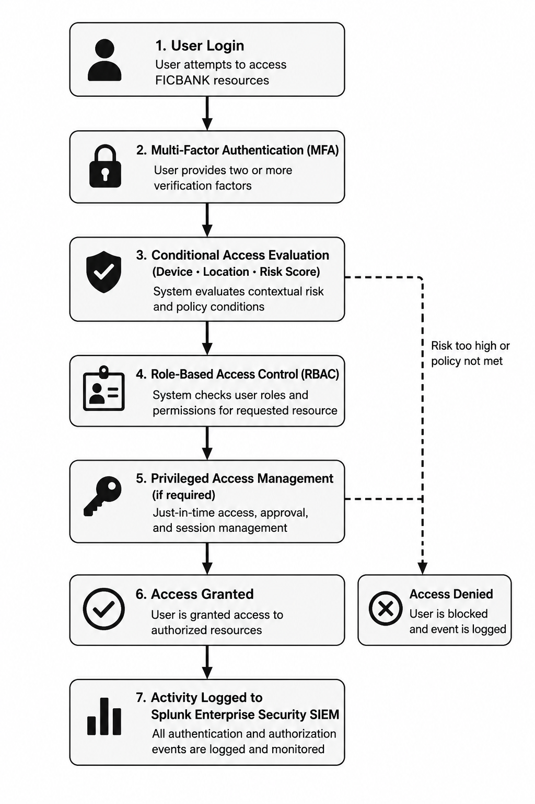

# Zero Trust Access Flow

This diagram applies NIST SP 800-207 principles to proposed FICBANK access decisions. Identity and Access Management verifies identity, the Policy Decision Point evaluates request context and least-privilege policy, and the Policy Enforcement Point allows or blocks the resulting connection to a protected resource.

This flow prevents network location or identity alone from granting trust and places all protected-resource access behind explicit policy enforcement. Context-aware, least-privilege decisions reduce exposed administrative access, while approved and denied events improve visibility into unauthorized activity and support investigation and endpoint response.

Figure 3-3 below demonstrates identity authentication and authorization workflow.

