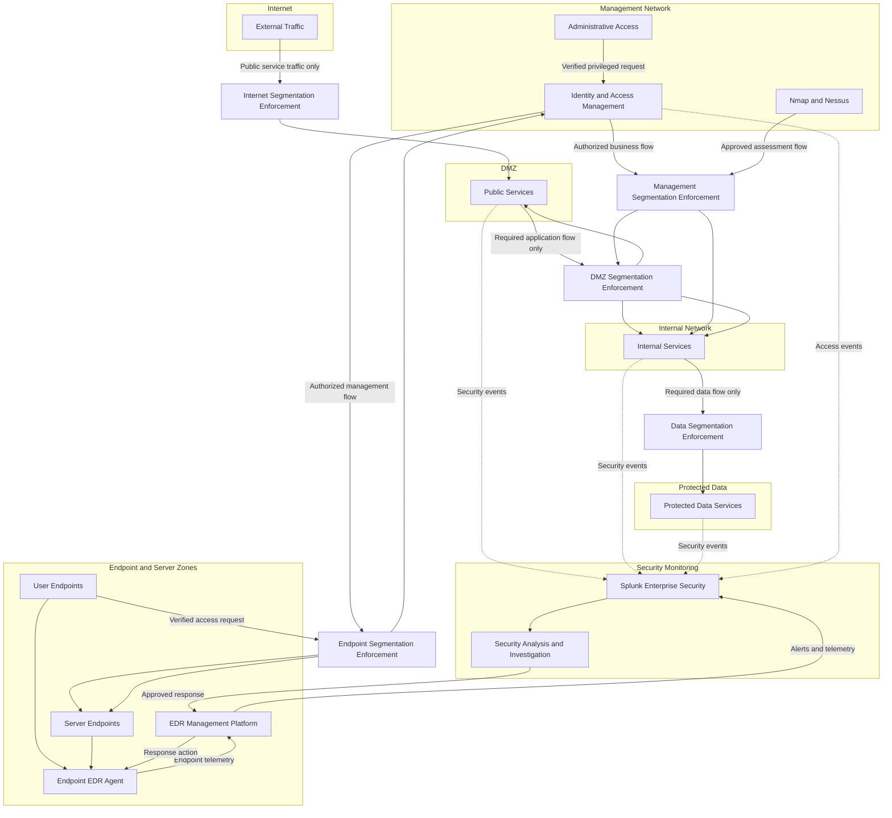
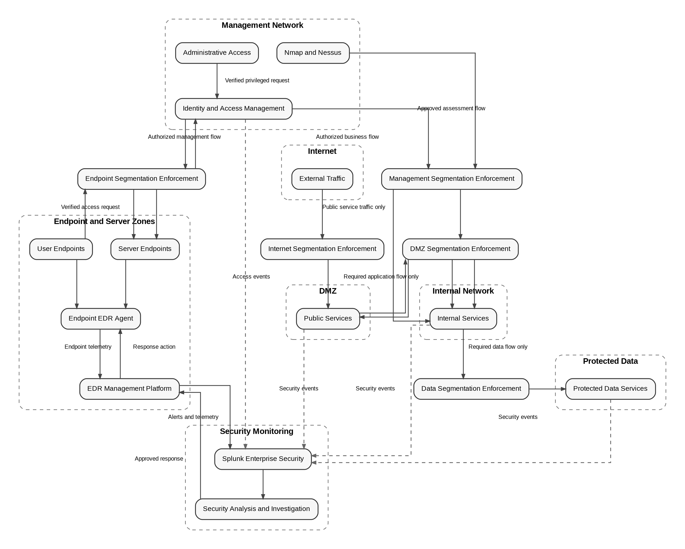
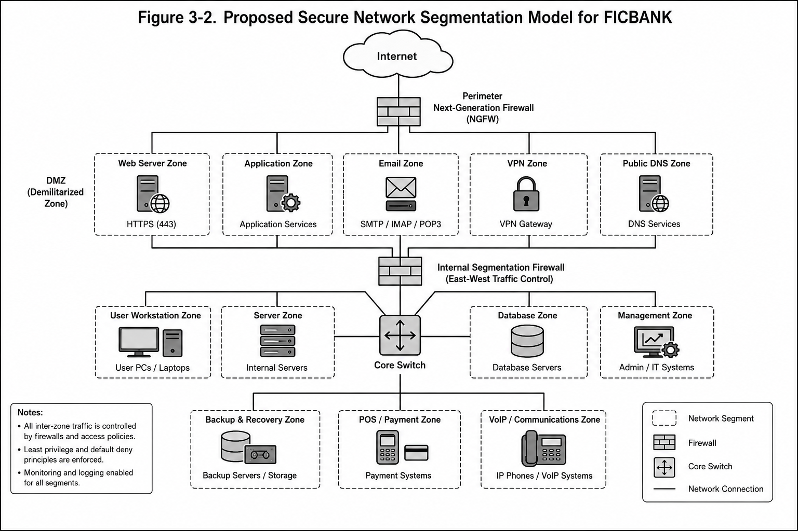

# Network Segmentation

This diagram defines proposed FICBANK security zones and their explicitly approved one-way flows. Segmentation enforcement controls separate the Internet, DMZ, internal services, protected data, management network, and endpoint/server zones, while endpoint protection and security monitoring retain controlled visibility and response paths.

The enforced zone boundaries replace weak segmentation with purpose-limited paths and no unrestricted bidirectional connections. They prevent direct Internet access to internal, management, data, and endpoint resources; restrict administrative and assessment traffic; and reduce exposure of SMB, RDP, SSH, and administrative interfaces while preserving monitoring and response.

Figure 3-2 below illustrates the proposed network segmentation architecture recommended for FICBANK. The design applies Zero Trust principles by separating enterprise resources into logical security zones protected through internal firewalls, least-privilege communication policies, and continuous monitoring.

