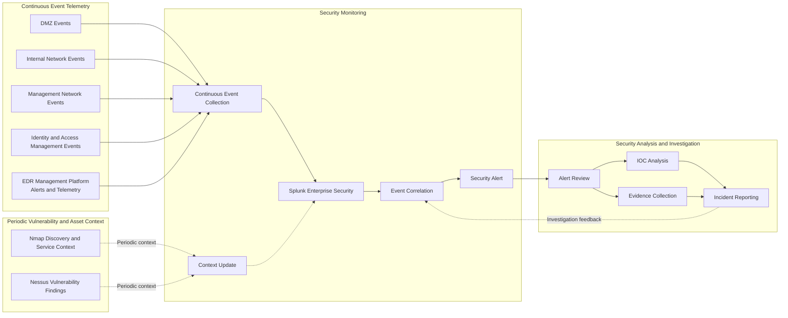

# Splunk Monitoring Architecture

This diagram separates continuous FICBANK security-event telemetry from periodic vulnerability and asset context before both reach Splunk Enterprise Security. Event correlation produces alerts for Security Analysis and Investigation, while contextual assessment data supports prioritization without being represented as real-time activity.

Continuous collection addresses incomplete operational visibility, while periodic Nmap and Nessus context helps analysts interpret affected assets and vulnerabilities without treating scans as live events. Correlation and the preserved investigation feedback loop reduce alerting gaps and support repeatable analysis of indicators of compromise and unauthorized activity.
