# Endpoint Detection and Response Workflow

This diagram describes the proposed FICBANK endpoint detection and response workflow. Endpoint EDR Agents send telemetry to the EDR Management Platform, platform alerts and telemetry feed Splunk Enterprise Security, and validated incidents trigger controlled response actions back through the platform to affected endpoints.

```mermaid
flowchart LR
    subgraph Endpoints[Endpoint Layer]
        USER[User Endpoints]
        SERVER[Server Endpoints]
        AGENT[Endpoint EDR Agent]
    end
    subgraph EDR[Endpoint Detection and Response]
        PLATFORM[EDR Management Platform]
    end
    subgraph Monitoring[Security Monitoring]
        SPLUNK[Splunk Enterprise Security]
        CORRELATE[Event Correlation]
        ALERT[Security Alert]
    end
    subgraph Investigation[Security Analysis and Investigation]
        TRIAGE[Alert Review]
        EVIDENCE[Evidence Collection and IOC Analysis]
        DECISION{Unauthorized Activity?}
        CLOSE[Document and Close]
        RESPONSE[Endpoint Response<br/>Host Isolation - Process Termination<br/>Artifact Quarantine - Evidence Preservation]
        REPORT[Incident Reporting]
    end
    USER -->|Endpoint activity| AGENT
    SERVER -->|Endpoint activity| AGENT
    AGENT -->|Endpoint telemetry| PLATFORM
    PLATFORM -->|Alerts and telemetry| SPLUNK
    SPLUNK --> CORRELATE
    CORRELATE --> ALERT
    ALERT --> TRIAGE
    TRIAGE --> EVIDENCE
    EVIDENCE --> DECISION
    DECISION -->|No| CLOSE
    DECISION -->|Yes| RESPONSE
    RESPONSE -->|Approved response command| PLATFORM
    PLATFORM -->|Response action| AGENT
    AGENT -->|Response status and preserved evidence| PLATFORM
    RESPONSE --> REPORT
    REPORT -.->|Investigation feedback| CORRELATE
```

The workflow adds endpoint visibility where monitoring was limited and provides a controlled route for host isolation, malicious-process termination, artifact quarantine, and evidence preservation. Central correlation and IOC analysis improve detection of unauthorized activity, while response status and investigation feedback support verification and future alert refinement.
