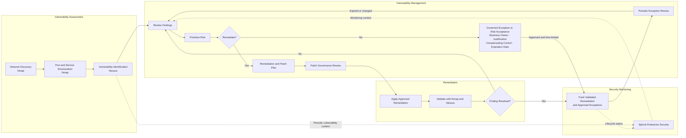
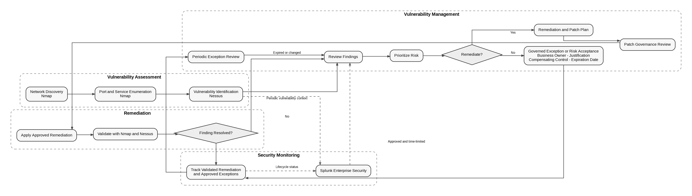
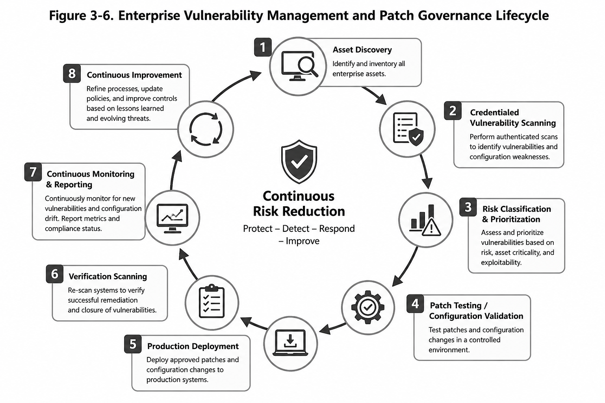

# Vulnerability Management Lifecycle

This diagram defines a proposed, repeatable FICBANK vulnerability-management lifecycle. It turns network discovery, port scanning, service enumeration, and Nessus findings into prioritized remediation or a governed, time-limited exception, with both outcomes tracked in Splunk Enterprise Security for continued review.

The lifecycle governs exposed SMB, RDP, SSH, administrative interfaces, and other findings through validated remediation or documented risk acceptance. Exceptions require ownership, justification, a compensating control, an expiration date, and periodic review; tracking both outcomes prevents silent closure and improves vulnerability visibility.

Figure 3-6 below illustrates the enterprise vulnerability management lifecycle recommended for FICBANK. The lifecycle integrates continuous asset discovery, authenticated vulnerability scanning, risk prioritization, patch governance, verification scanning, and ongoing monitoring to support continuous cybersecurity improvement.

